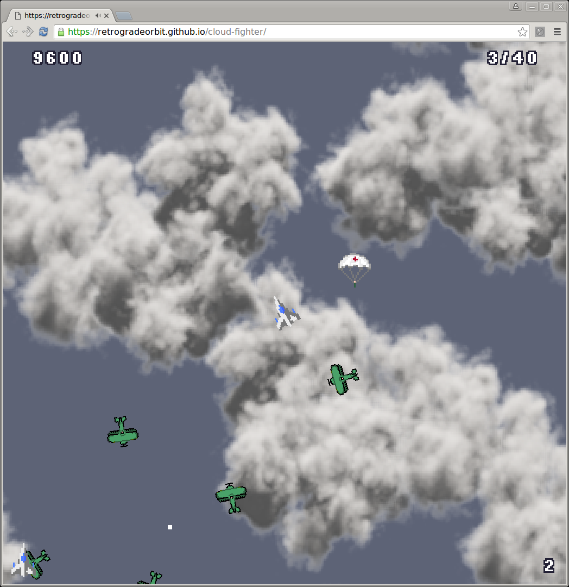
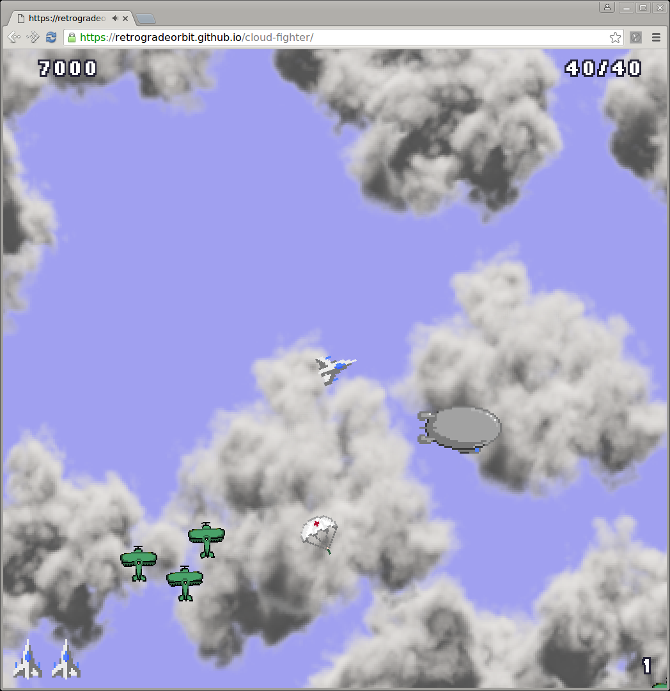
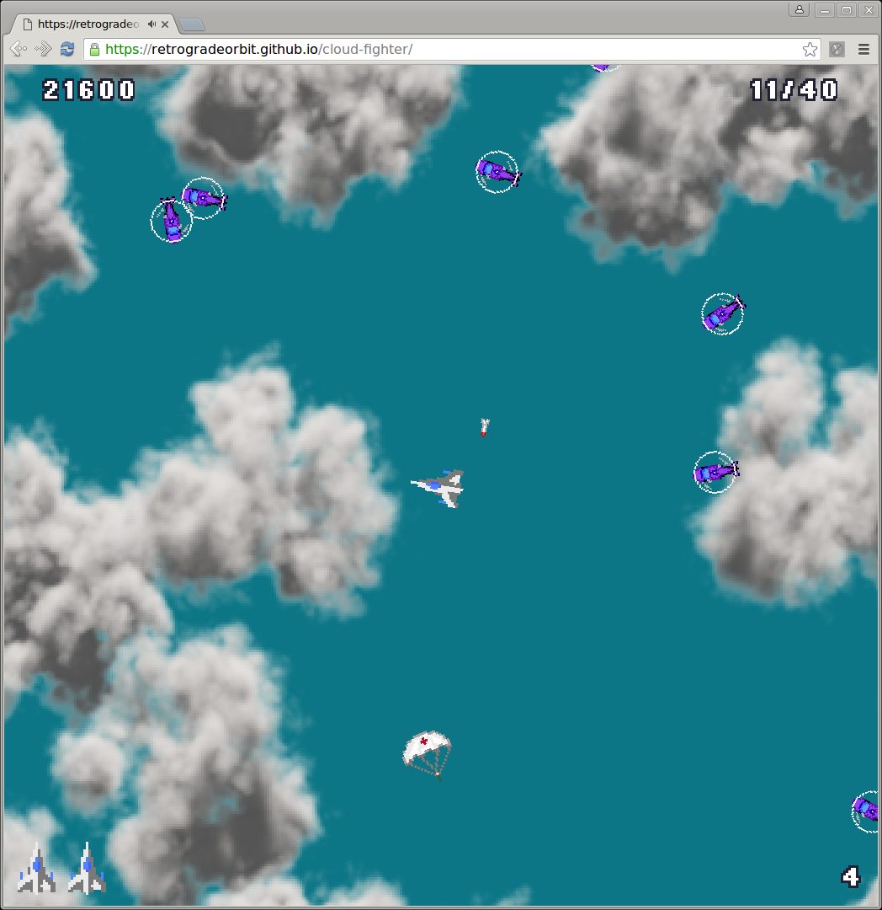
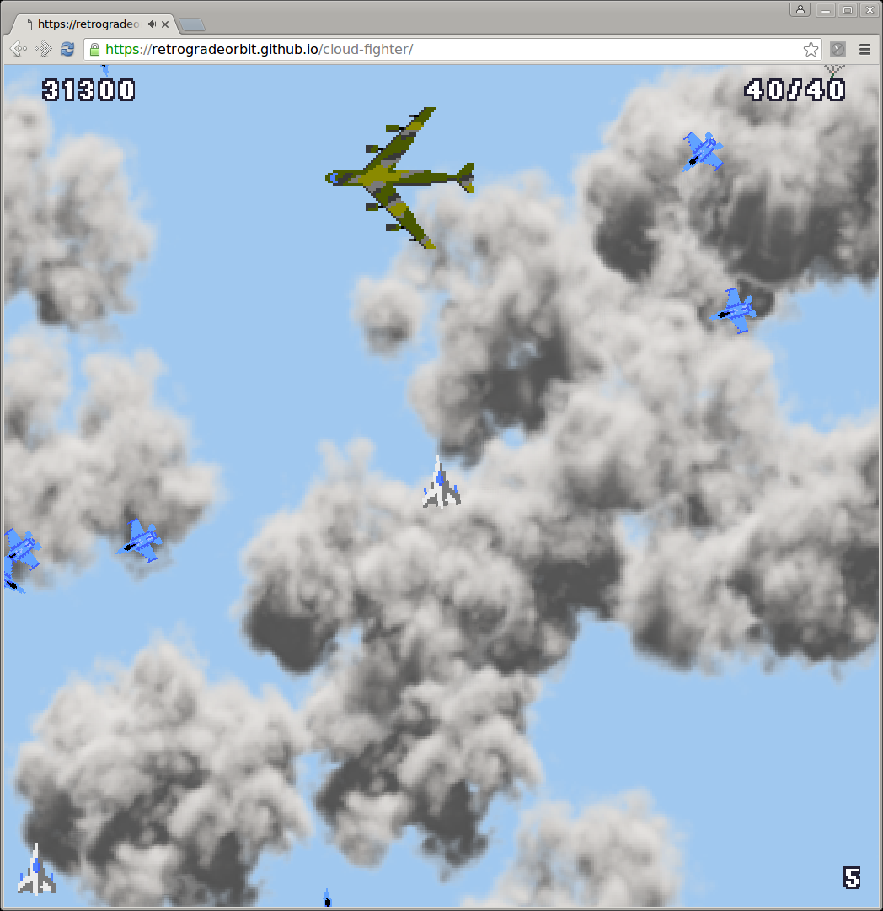
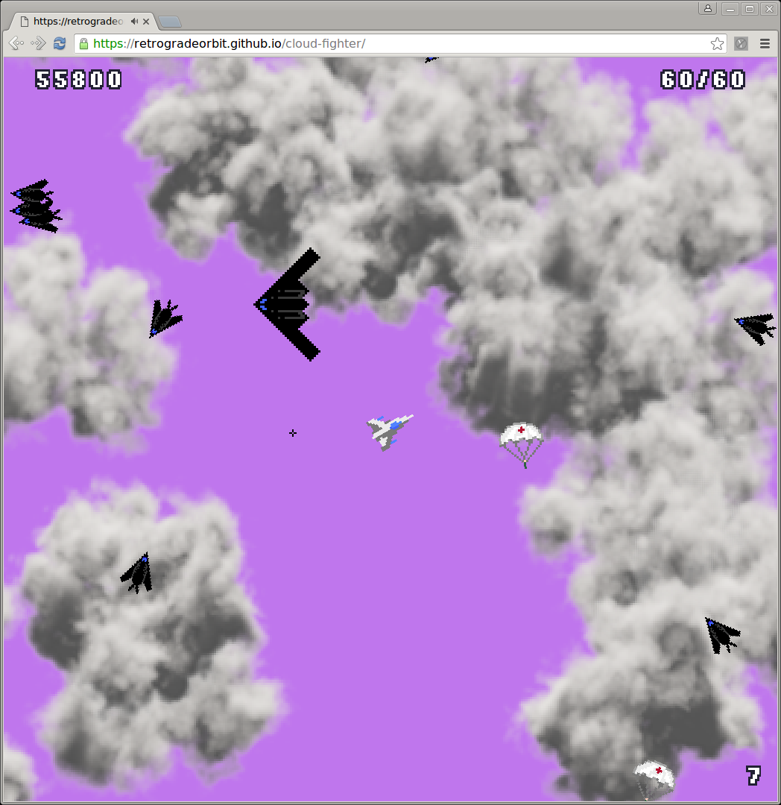

# Cloud Fighter

A game done for the August 2016 Lisp Gamejam

[PLAY IT NOW!](https://retrogradeorbit.github.io/cloud-fighter/)

## Overview

###A modern remake of the 1982 arcade classic, Time Pilot.

Plug in your
game controller and use the analog stick to control the direction of
your ship. Press a button to shoot. Blast wave after wave of enemies
until the mothership appears. Then blast it out of existence to move
forwards in time to the next wave.

Collect stranded parachuting pilots along the way for bonus
points. Avoid enemy bullets and missiles and stay on your toes. And
don't crash into the mothership!

Start with biplanes and blimps, move through helicopters and chinooks,
onto jet fighters and B52 bombers, into the era of stealth and then
beyond into the future!

When you complete all ten levels, the levels start again, but with
everything 25% faster! How fast can you go?

Extra lives at 10,000 and 60,000 points, and then every 50,000 after
that.

   

Written in ClojureScript in 10 days for August Lisp 2016 Gamejam

Source code: https://github.com/retrogradeorbit/cloud-fighter

Developed with the InfiniteLives ClojureScript game framework:
https://infinitelives.github.io/ in particular:
https://github.com/infinitelives/infinitelives.pixi

Play it on itch.io: https://retrogradeorbit.itch.io/cloud-fighter

Play on github.io: https://retrogradeorbit.github.io/cloud-fighter/

Definitely play with an analog gamepad!  (its much, much harder to
play with the keyboard)

Runs best in Chrome

## Setup

Install the latest version of
[infinitelives.utils](https://github.com/infinitelives/infinitelives.utils).
Clone the repo, go into the directory and issue `lein install` to
install the jar into your local maven repo.

Do the same for
[infinitelives.pixi](https://github.com/infinitelives/infinitelives.pixi).
Clone the repo, go into the directory and issue `lein install` to
install the jar into your local maven repo.

To get an interactive development environment run:

    lein figwheel

and open your browser at [localhost:3449](http://localhost:3449/).
This will auto compile and send all changes to the browser without the
need to reload. After the compilation process is complete, you will
get a Browser Connected REPL. An easy way to try it is:

    (js/alert "Am I connected?")

and you should see an alert in the browser window.

To clean all compiled files:

    lein clean

To create a production build run:

    lein do clean, cljsbuild once min

And open your browser in `resources/public/index.html`. You will not
get live reloading, nor a REPL.

## License

Copyright © 2016 Crispin Wellington

Distributed under the Eclipse Public License either version 1.0 or (at your option) any later version.
